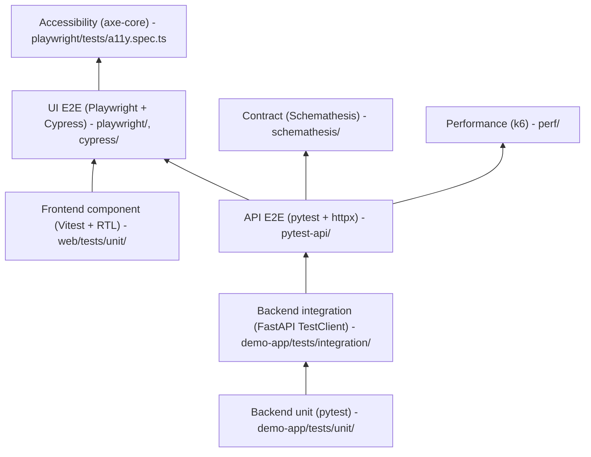

# qa-automation-lab

A self-contained, multi-framework test automation lab demonstrating a full test pyramid plus cross-cutting contract, accessibility, and performance coverage against one bundled React + FastAPI system under test (SUT).

[](https://github.com/DwonnG/qa-automation-lab/actions/workflows/ci.yml)
[](https://github.com/DwonnG/qa-automation-lab/actions/workflows/pages.yml)
[](./demo-app)
[](./web)
[](LICENSE)

> **Dashboard & live SUT:** [dwonng.github.io/qa-automation-lab](https://dwonng.github.io/qa-automation-lab/) — auto-published reports for every suite (Backend, Web component, API E2E, Contract, Playwright, Cypress, k6) from the latest CI run on `main`, plus an interactive build of the React half of the SUT itself (FastAPI swapped for MSW so it runs on a static host). PIN: `000000`.
>
> Preview the dashboard locally before pushing:
>
> ```bash
> ./scripts/preview-pages.sh
> # → http://localhost:8765/qa-automation-lab/
> ```

## Why this repo exists

Most test-automation portfolios show one framework against a synthetic API. This repo shows how a staff-level SDET thinks across the whole pyramid:

- **Five test layers** validating correctness from pure-logic unit tests up to UI E2E
- **Three cross-cutting layers** validating compliance and capacity (contract, a11y, performance)
- **An AI eval layer** that scores non-deterministic LLM output against a golden dataset with LangSmith tracing and pass-rate thresholds
- **Each framework used in its own idiom** — POM in Playwright, App Actions in Cypress, abstract clients in pytest
- **One bundled target app** so the whole pyramid runs offline on any machine



## Stack

| Layer          | Tools                                                                                                                             |
| -------------- | --------------------------------------------------------------------------------------------------------------------------------- |
| Backend        | Python 3.13, FastAPI, Pydantic v2, uv, ruff                                                                                       |
| Frontend       | Node 22 LTS, React 19, Vite 6, TypeScript 5.7 strict, TailwindCSS 4, shadcn/ui, TanStack Query v5, React Hook Form + Zod, pnpm 10 |
| Backend tests  | pytest, pytest-cov, pytest-xdist, pytest-randomly, Faker                                                                          |
| Frontend tests | Vitest 2, React Testing Library, MSW v2, @faker-js/faker                                                                          |
| API tests      | pytest, httpx                                                                                                                     |
| Contract tests | Schemathesis 4                                                                                                                    |
| UI E2E         | Playwright 1.55+, Cypress 14, @axe-core/playwright                                                                                |
| Performance    | k6                                                                                                                                |
| LLM evals      | LangSmith tracing, Anthropic Claude, pytest-driven LLM-as-judge against a golden dataset                                          |
| Hygiene        | pre-commit, ruff, prettier, eslint, gitleaks, commitlint, typos, Dependabot                                                       |
| Infra          | Docker (multi-stage), GitHub Actions                                                                                              |

## Quick start (Docker)

```bash
docker compose up
```

Visit `http://localhost:5050`. PIN to log in: `000000`.

## Quick start (local)

Two terminals for the best dev experience:

```bash
# terminal 1 - backend
cd demo-app
uv sync
uv run uvicorn demo_app.main:app --port 5050

# terminal 2 - frontend (hot reload)
cd web
pnpm install
pnpm dev
```

The Vite dev server runs on `:5173` and proxies `/api/*` to `:5050`.

For a production-shaped single-port run:

```bash
cd web && pnpm install && pnpm build
cd ../demo-app && uv sync && uv run uvicorn demo_app.main:app --port 5050
```

## Run each test suite

| Suite                      | Command                                                           |
| -------------------------- | ----------------------------------------------------------------- |
| Backend unit + integration | `cd demo-app && uv run pytest`                                    |
| Frontend component         | `cd web && pnpm test`                                             |
| API E2E                    | `cd pytest-api && uv run pytest` (requires running server)        |
| Contract                   | `cd schemathesis && uv run pytest` (requires running server)      |
| Playwright                 | `cd playwright && pnpm test`                                      |
| Cypress                    | `cd cypress && pnpm cypress run`                                  |
| Performance (k6)           | `k6 run perf/items_smoke.js`                                      |
| LLM evals (offline)        | `cd llm-evals && uv run pytest -m "not live"`                     |
| LLM evals (live)           | `cd llm-evals && uv run pytest -m live` (needs ANTHROPIC_API_KEY) |

See [CONTRIBUTING.md](CONTRIBUTING.md) for full setup.

## Architecture decisions

Non-obvious decisions are documented as ADRs in [`docs/adr/`](docs/adr/):

- [0001](docs/adr/0001-use-fastapi-over-flask.md) - FastAPI over Flask
- [0002](docs/adr/0002-no-pom-in-cypress.md) - No POM in Cypress
- [0003](docs/adr/0003-no-test-class-inheritance.md) - No test-class inheritance
- [0004](docs/adr/0004-single-port-spa-deploy.md) - Single-port SPA deploy

## Built by

[Dwonn Goodwin](https://dwgoodwi.github.io) - Staff-level SDET and AI test automation leader.
